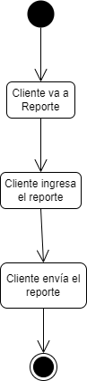

# Web Concesionaria

Documentación y aplicación realizada como parte del proyecto de la materia Especificación y Verificación del Software del tercer año de la carrera Licenciatura en Sistemas de la Universidad Nacional General Sarmiento.

Web concesionaria es un proyecto que involucra todos los procesos de la especificación del software. Se presentará un FRD (<i>Funcional-Requirements Document</i>) que detalla las funciones y características que la aplicación debe tener para satisfacer las necesidades y requerimientos del cliente o usuario final. Este README tiene como prioridad mostrar la resolución del proyecto requerido  [(Clic para ver)](https://drive.google.com/file/d/1tbtCckbOMqPqSq6-NatIitBgfBcZY125/view?usp=sharing). Por lo tanto la documentación del código de la aplicación no es presentada, porque el objetivo principal del proyecto es mostrar la puesta en práctica de los conceptos de FRD.

## Tabla de contenidos

- [Introducción](#introducción)
- [1 FR Change History](#1-fr-change-history)
- [2 Scope Statement](#2-scope-statement)
  - [2.1 Project Description/Objectives](#21-project-descriptionobjectives)
  - [2.2 Justification](#22-justification)
  - [2.3 Assumptions](#23-assumptions)
  - [2.4 Constraints](#24-constraints)
  - [2.5 Dependencies](#25-dependencies)
  - [2.6 Acceptance Criteria](26-acceptance-criteria-critical-succes-factors)
  - [2.7 Scope](#27-scope)
- [3 Business Requirements Information](#3-business-requirements-information)
  - [3.1 Business Rules](#31-business-rules)
  - [3.2 Business Requirements](#32-business-requirements) 
- [4 Functional Requirements](#4-functional-requirements)
  - [4.1 User Stories](#41-user-stories) 
    - [Epic: Registro](#epic-registro)
    - [Epic: Seguro y Garantía](#epic-seguro-y-garantía)
    - [Epic: Service](#epic-service)
    - [Epic: Compra/Venta de vehículos](#epic-compraventa-de-vehículos)
    - [Epic: Administración de la aplicación](#epic-administración-de-la-aplicación)
    - [Epic: Configuración de la aplicación](#epic-configuración-de-la-aplicación)
  - [4.2 Diagrama de clases](#42-diagrama-de-clases)
  - [4.3 Diagrama de secuencia](#43-diagrama-de-secuencia)
  - [4.4 Diagrama de actividad](44-diagrama-de-actividad)
  - [4.5 Test cases](#45-test-cases)
- [Logros](#logros) 

## Introducción

<b>Kilmister</b>, empresa fundada por Lemmy, un ex CEO de una importante automotriz francesa, nos solicita una aplicación web para facilitar la compra/venta de vehículos multimarca, llevar el control de los vehículos que se comercializan y administrar el contacto con los clientes. El alcance que se requiere es a nivel nacional. (Para ver la solicitud del cliente completa [(Clic aquí)](https://drive.google.com/file/d/1tbtCckbOMqPqSq6-NatIitBgfBcZY125/view?usp=sharing).

El siguiente documento presenta el análisis de requerimientos de la solicitud del cliente, el diagrama de clases que modelará el sistema, los diagramas de secuencia, de actividad y todos los casos de prueba.

## Functional Requirement Document
#### Sistema de Compra/Venta de Vehículos

<table border="1">
<tr>
  <td>Version:</td>
  <td>1.0</td>
</tr>
<tr>
  <td>Date:</td>
  <td>03/09/2021</td>
</tr>
<tr>
  <td>Business / Operations Sponsor:</td>
  <td>Ciarallo,   Lamuedra.</td>
</tr>
<tr>
  <td>Sponsor Organization:</td>
  <td>UNGS</td>
</tr>
<tr>
  <td>BA Authors:</td>
  <td>Elias</td>
</tr>
<tr>
  <td>Target Release:</td>
  <td>Noviembre 2021</td>
</tr>
</table>

## 1 FR Change History

<table>
  <tr>
    <td>Name</td>
    <td>Date of change</td>
    <td>Owner of change</td>
    <td>Description</td>
  </tr>
   <tr>
    <td>Diagrama de clases</td>
    <td>5/11/2021</td>
    <td>Elias</td>
    <td>Reestructuración de algunas clases del diagrama.</td>
  </tr>
   <tr>
    <td>User stories</td>
    <td>5/11/2021</td>
    <td>Elias</td>
    <td>Se agrega los criterios de aceptación de la user story 03 y 08.</td>
  </tr>
   <tr>
    <td>Subdiagrama de actividad "El cliente paga"</td>
    <td>5/11/2021</td>
    <td>Elias</td>
    <td>Se agreaga una rama más para tener testeado todos los medios de pago.</td>
  </tr>
   <tr>
    <td>User stories de requerimientos no funcionales</td>
    <td>9/11/2021</td>
    <td>Elias</td>
    <td>Se añaden las user stories de los requerimientos no funcionales.</td>
  </tr>
   <tr>
    <td>Test automatizado</td>
    <td>20/11/2021</td>
    <td>Elias</td>
    <td>Se añaden las automatizaciones de las funcionalidad de Registro, Service y Login.</td>
  </tr>
   <tr>
    <td>Business Requirements</td>
    <td>20/11/2021</td>
    <td>Elias</td>
    <td>Se añade el requerimiento funcional Login</td>
  </tr>
  <tr>
    <td>User story Login</td>
    <td>20/11/2021</td>
    <td>Elias</td>
    <td>Se añade la user story Login.</td>
  </tr>
  
</table>

[Volver a Tabla de contenidos](#tabla-de-contenidos)

## 2 Scope Statement

### 2.1 Project Description/Objectives
  - 2.1.1 Project Description/Objectives 
    > Necesitamos un sistema que permita a los potenciales clientes poder realizar una compra/venta de vehículos.
  - 2.2 Non-Financial Benefits
    > Que sea más fácil de usar para los clientes y compatible con los navegadores actuales.
  - 2.1.3 Method for Measuring Benefits
    > El sistema debe pedir a los clientes una encuesta de satisfacción.
### 2.2 Justification
  > Queremos facilitar la compra/venta de vehículos para los clientes.
### 2.3 Assumptions
  > El presupuesto para realizar el sistema está asegurado por 3 meses.
### 2.4 Constraints
  > El equipo completo tiene que realizar el sistema.
### 2.5 Dependencies
  > No hay dependencias
### 2.6 Acceptance Criteria (Critical Succes Factors)
  > Que se pueda realizar compra/venta de vehículos mediante el uso del sistema.
### 2.7 Scope
  > Poder ver información de vehículos y realizar una compra/venta.

[Volver a Tabla de contenidos](#tabla-de-contenidos)
  
## 3 Business Requirements Information

### 3.1 Business Rules
  > Todos los montos se cobran en ARS (Peso Argentino). 
   El password debe ser alfanumérico con mínimo de 8 caracteres.
### 3.2 Business Requirements

### Clasificación de requerimientos

- Funcional: Características, capacidades y seguridad.
- Usabilidad: Factores humanos, ayuda, documentación, navegación.
- Soporte: Adaptabilidad, facilidad de mantenimiento, internacionalización, configurabilidad.
- Implementación: Limitación de recursos, lenguajes, herramientas, hardware.
- Operaciones: Gestión del sistema en su puesta en marcha.

<table border="1">
<tr>
  <td>1.</td>
  <td>La aplicación debe pedir a los clientes una encuesta de satisfacción.</td>
  <td>Usabilidad</td>
</tr>
 <tr>
  <td>2.</td>
  <td>La aplicación debe ser fácil de usar para los clientes.</td>
  <td>Usabilidad</td>
</tr>
 <tr>
  <td>3.</td>
  <td>La aplicación debe ser compatible con los navegadores actuales.</td>
  <td>Soporte</td>
</tr>
 <tr>
  <td>4.</td>
  <td>El cliente debe registrarse con: nombre, apellido, domicilio, DNI, fecha de nacimiento, datos de tarjeta de crédito, email y contraseña.</td>
  <td>Funcional</td>
</tr>
 <tr>
  <td>5.</td>
  <td>El cliente opcionalmente puede registrar una cuenta bancario y/o Mercado Pago, en caso de no contar con tarjeta de crédito a su nombre.</td>
  <td>Funcional</td>
</tr>
 <tr>
  <td>6.</td>
  <td>El cliente debe indicar si es un vendedor, comprador o ambas.</td>
  <td>Funcional</td>
</tr>
 <tr>
  <td>7.</td>
  <td>El vendedor debe registrar el vehículo que desea vender, si acepta permuta y una descripción del mismo con fotos.</td>
  <td>Funcional</td>
</tr>
 <tr>
  <td>8.</td>
  <td>La aplicación debe ofrecer el servicio de compra de vehículos.</td>
  <td>Funcional</td>
</tr>
 <tr>
  <td>9.</td>
  <td>La aplicación debe ofrecer el servicio de venta de vehículos.</td>
  <td>Funcional</td>
</tr>
 <tr>
  <td>10.</td>
  <td>La aplicación debe ofrecer el servicio de service/mantenimiento.</td>
  <td>Funcional</td>
</tr>
 <tr>
  <td>11.</td>
  <td>La aplicación debe ofrecer el servicio de seguro.</td>
  <td>Funcional</td>
</tr>
 <tr>
  <td>12.</td>
  <td>La aplicación debe ofrecer el servicio de garantía.</td>
  <td>Funcional</td>
</tr>
 <tr>
  <td>13.</td>
  <td>El comprador puede buscar vehículos en la aplicación.</td>
  <td>Funcional</td>
</tr>
 <tr>
  <td>14.</td>
  <td>La aplicación debe mostrar un filtro de búsqueda para los vehículos.</td>
  <td>Usabilidad</td>
</tr>
 <tr>
  <td>15.</td>
  <td>El comprador puede reservar el vehículo con una seña de $10000.</td>
  <td>Funcional</td>
</tr>
 <tr>
  <td>16.</td>
  <td>La aplicación debe verificar la veracidad del comprador y del vendedor.</td>
  <td>Funcional</td>
</tr>
 <tr>
  <td>17.</td>
  <td>La aplicación debe informar, luego de 48hs hábiles, si el comprador puede continuar o no con la operación.</td>
  <td>Usabilidad</td>
</tr>
 <tr>
  <td>18.</td>
  <td>El gestor debe ponerse en contacto con el comprador para solicitarle la documentación.</td>
  <td>Usabilidad</td>
</tr>
 <tr>
  <td>19.</td>
  <td>El comprador debe depositar la mitad del valor del vehículo en un plazo de 72hs hábiles.</td>
  <td>Funcional</td>
</tr>
 <tr>
  <td>20.</td>
  <td>La aplicación debe quitar la publicación del vehículo una vez que el comprador haya depositado la mitad del valor.</td>
  <td>Funcional</td>
</tr>
 <tr>
  <td>21.</td>
  <td>El gestor debe reunir al comprador y el vendedor en el registro correspondiente para hacer la entrega del vehículo, previa cancelación del pago por parte del vendedor.</td>
  <td>Usabilidad</td>
</tr>
 <tr>
  <td>22.</td>
  <td>El comprador debe abonar los gastos de la transferencia.</td>
  <td>Usabilidad</td>
</tr>
 <tr>
  <td>23.</td>
  <td>La aplicación debe transferir el dinero al vendedor luego de concretarse la operación, descontando 5% del total para la comisión.</td>
  <td>Funcional</td>
</tr>
 <tr>
  <td>24.</td>
  <td>El cliente puede realizar desde la aplicación el service del vehículo reservando la fecha y el horario.</td>
  <td>Funcional</td>
</tr>
 <tr>
  <td>25.</td>
  <td>El cliente debe pagar a través de la aplicación.</td>
  <td>Funcional</td>
</tr>
 <tr>
  <td>26.</td>
  <td>La aplicación debe cobrar al taller el 3% de la comisión del pago del cliente.</td>
  <td>Funcional</td>
</tr>
 <tr>
  <td>27.</td>
  <td>La aplicación debe mostrar la información de los vehículos.</td>
  <td>Funcional</td>
</tr>
 <tr>
  <td>28.</td>
  <td>La aplicación debe tener un alcance a nivel nacional.</td>
  <td>Soporte</td>
</tr>
 <tr>
  <td>29.</td>
  <td>La aplicación debe ofrecer garantía sobre el vehículo por 2 años, la cual entra en vigencia luego del service.</td>
  <td>Funcional</td>
</tr>
 <tr>
  <td>30.</td>
  <td>El cliente debe poder contratar un seguro para el vehículo a través de la aplicación.</td>
  <td>Funcional</td>
</tr>
 <tr>
  <td>31.</td>
  <td>La aplicación debe cobrar la cuota del seguro mensualmente y la comisión es del 1%.</td>
  <td>Funcional</td>
</tr>
 <tr>
  <td>32.</td>
  <td>La aplicación debe correr en un entorno Linux.</td>
  <td>Implementación</td>
</tr>
 <tr>
  <td>33.</td>
  <td>El personal de soporte debe estar disponible 24hs todos los días de la semana.</td>
  <td>Operaciones</td>
</tr>
 <tr>
  <td>34.</td>
  <td>La aplicación debe enviar un comercial a los clientes.</td>
  <td>Usabilidad</td>
</tr>
 <tr>
  <td>35.</td>
  <td>El cliente debe reportar una consulta o problema a través de la aplicación.</td>
  <td>Funcional</td>
</tr>
 <tr>
  <td>36.</td>
  <td>El administrador debe responder los reportes a través de la aplicación.</td>
  <td>Funcional</td>
</tr>
 <tr>
  <td>37.</td>
  <td>La aplicación debe detectar una cantidad determinada de incumplimientos por parte de algún cliente.</td>
  <td>Funcional</td>
</tr>
 <tr>
  <td>38.</td>
  <td>El administrador debe llamar a un cliente que sea detectado como incumplidor.</td>
  <td>Usabilidad</td>
</tr>
 <tr>
  <td>39.</td>
  <td>El director estaría interesado en que la aplicación elabore un registro de una cantidad determinada de incumplimientos automáticamente.</td>
  <td>Funcional</td>
</tr>
 <tr>
  <td>40.</td>
  <td>Se evalúa la posibilidad de enviar una grúa/camilla para trasladar los vehículos del los clientes.</td>
  <td>Usabilidad</td>
</tr>
 <tr>
  <td>41.</td>
  <td>Al director le gustaría en el futuro que los clientes puedan usar el sistema desde su tablet o teléfono.</td>
  <td>Soporte</td>
</tr>
 <tr>
  <td>42.</td>
  <td>El director estaría interesado en obtener reportes mensuales de cantidad de vehículos publicados, cantidad de operaciones realizadas, cantidad de clientes registrados y cantidad de consultas/reclamos.</td>
  <td>Funcional</td>
</tr>
<tr>
  <td>43.</td>
  <td>La aplicación debe tener un login.</td>
  <td>Funcional</td>
</tr>   
</table>

[Volver a Tabla de contenidos](#tabla-de-contenidos)

## 4 Functional Requirements

### 4.1 User Stories

 ### EPIC: REGISTRO

 <table border="1">
<tr>
  <td align="center">
    <b>User story 01</b>   
    

      Como cliente quiero registrarme en la aplicación para utilizar los privilegios de un usuario registrado. También quiero indicar si me registro como comprador, vendedor o ambas.   CA: Se debe ingresar nombre, apellido, dni, fecha de nacimiento, datos de tarjeta de crédito, email, contraseña. La tarjeta de crédito debe ser verdadera y válida. Debe haber una opción que indique que puede ser ambas.
    

  </td>
</tr>
<tr>
  <td align="center">
    <b>User story 02</b>   
    

      Como cliente quiero la oportunidad de ingresar una cuenta bancaria o Mercado Pago para el caso que no tenga tarjeta de crédito.  CA: Para la cuenta bancaria se necesita CBU, titular y CUIL. Para Mercado Pago se necesita el nombre de usuario.
    

  </td>
</tr>
  <tr>
  <td align="center">
    <b>User story 03</b>   
    

      Como vendedor quiero registrar el vehículo e indicar si está a la venta o permuta junto a una descripción y fotos.   CA: Si es un cliente que solo quiere realizar el service no debe indicar si está a la venta o permuta ni subir una descripción y fotos.
    

  </td>
</tr>
 <tr>
  <td align="center">
    <b>User story 04</b>   
    

      Como director quiero un reporte con la cantidad de clientes registrados.  CA: Debe reportarse de forma mensual.
    

  </td>
</tr>
 <tr>
  <td align="center">
    <b>User story 05</b>   
    

     Como cliente quiero poder loguearme para utilizar los servicios exclusivos de un cliente registrado.  CA: Los datos que se ingresan deben ser consultados en una base de datos con los clientes registrados.
    

  </td>
</tr>
 </table>

[Volver a Tabla de contenidos](#tabla-de-contenidos)

### EPIC: SEGURO Y GARANTÍA

<table border="1">
<tr>
  <td align="center">
    <b>User story 06</b>   
    

      Como productor de seguros quiero ofrecer seguros para el vehículo para que el cliente lo contrate en la aplicación.  CA: El seguro lo puede conseguir cualquier persona que esté registrada en la aplicación. La cuota es mensual y nos corresponde un 1% en concepto de comisión. La comisión puede modificarse en el futuro.
    

  </td>
</tr>
 <tr>
  <td align="center">
    <b>User story 07</b>   
    

      Como empresa quiero ofrecer una garantía sobre el vehículo.  CA: La garantía debe durar 2 años. solo se otorga después del service. El tiempo de garantía no se extiende.
    

  </td>
</tr>
 <tr>
  <td align="center">
    <b>User story 08</b>   
    

      Como cliente quiero poder contratar un seguro para el vehículo.  CA: Por el momento deben estar los seguros Pagano y Nosvi.
    

  </td>
</tr>
</table>

[Volver a Tabla de contenidos](#tabla-de-contenidos)

### EPIC: SERVICE

<table border="1">
<tr>
  <td align="center">
    <b>User story 09</b>   
    

      Como cliente quiero realizar el service del vehículo y pagarlo a través de la aplicación.  CA: Para reservar debe elegir la fecha, el horario y elegir un taller disponible.
    

  </td>
</tr>
 <tr>
  <td align="center">
    <b>User story 10</b>   
    

      Como aplicación quiero cobrar el 3% de la comisión del pago del cliente al taller.
    

  </td>
</tr>
</table>

[Volver a Tabla de contenidos](#tabla-de-contenidos)

### EPIC: COMPRA/VENTA DE VEHÍCULOS

<table border="1">
<tr>
  <td align="center">
    <b>User story 11</b>   
    

      La aplicación debe tener filtros de búsqueda.  CA: Los filtros deben ser: tipo, marca, modelo, rango de precio, nuevo/usado. 
    

  </td>
   <tr>
  <td align="center">
    <b>User story 12</b>   
    

      Como comprador quiero reservar un vehículo con una seña para asegurar la compra.  CA: La seña debe ser de $10000.
    

  </td>
</tr>
 <tr>
  <td align="center">
    <b>User story 13</b>   
    

      Como gestor quiero verificar la veracidad del comprador y el vendedor.  CA: Deben estar todos los datos cargados. Para el vendedor se necesito el 08, cédula, título. Para el comprador el DNI.
    

  </td>
</tr>
  <tr>
  <td align="center">
    <b>User story 14</b>   
    

      Como comprador quiero depositar la mitad del dinero dentro de las 72hs hábiles.
    

  </td>
</tr>
  <tr>
  <td align="center">
    <b>User story 15</b>   
    

      Como vendedor quiero que se quite la publicación del vehículo una vez que el comprador haya depositado el total del valor.
    

  </td>
</tr>
  <tr>
  <td align="center">
    <b>User story 16</b>   
    

      Como empresa quiero transferir el dinero al vendedor luego de concretarse la operación descontando la comisión.  CA: La comisión es del 5% pero se puede modificar en el futuro.
    

  </td>
</tr>
</table>

[Volver a Tabla de contenidos](#tabla-de-contenidos)

### EPIC: ADMINISTRACIÓN DE LA APLICACIÓN

<table border="1">
<tr>
  <td align="center">
    <b>User story 17</b>   
    

      Como cliente quiero reportar o consultar un problema a través de la aplicación.  CA: El reporte debe guardarse en el sistema para ser consultado por un administrador.
    

  </td>
</tr>
 <tr>
  <td align="center">
    <b>User story 18</b>   
    

      Como administrador quiero responder los reportes a través de la aplicación.  CA: Los reportes deben ser consultados en la aplicación.
    

  </td>
</tr>
 <tr>
  <td align="center">
    <b>User story 19</b>   
    

      Como director quiero que la aplicación detecte una cantidad determinada de incumplimientos por parte de algún cliente.  CA: Con cada incumplimiento dar aviso.
    

  </td>
</tr>
 <tr>
  <td align="center">
    <b>User story 20</b>   
    

      Como director quiero un reporte de la cantidad de consultas y reclamos registrados.  CA: Debe reportarse de forma mensual.
    

  </td>
</tr>
 <tr>
  <td align="center">
    <b>User story 21</b>   
    

     La aplicación debe pedir a los clientes una encuesta de satisfacción.  CA: Los campos para llenar la encuesta se dejan a criterio de los desarrolladores. Para completarla se debe estar registrado en la aplicación.
    

  </td>
</tr>
 <tr>
  <td align="center">
    <b>User story 22</b>   
    

      El personal de soporte debe estar disponible las 24hs todos los días de la semana.  CA: Implementar un sistema de fichado de personal.
    

  </td>
</tr>
 <tr>
  <td align="center">
    <b>User story 23</b>   
    

      La aplicación debe enviar un comercial a los clientes.  CA: Un empleado debe elaborar reportes semanales con los vehículos disponibles y talleres habilitados. Debe ser a través de la aplicación.
    

  </td>
</tr>
 <tr>
  <td align="center">
    <b>User story 24</b>   
    

     El administrador debe llamar al cliente que sea detectado como incumplidor.  CA: Por cada incumplimiento se debe dar aviso.
    

  </td>
</tr>
 <tr>
  <td align="center">
    <b>User story 25</b>   
    

      En el futuro la aplicación debe enviar una grúa/camilla para trasladar los vehículos de los clientes.  CA: Se evaluará la compra de vehículos de acarreo y camillas o la tercerización del servicio.
    

  </td>
</tr>
</table>

[Volver a Tabla de contenidos](#tabla-de-contenidos)

### EPIC: CONFIGURACIÓN DE LA APLICACIÓN

<table border="1">
<tr>
  <td align="center">
    <b>User story 26</b>   
    

      La aplicación debe ser fácil de usar para los usuarios.  CA: Hacer pruebas de caja negra con los potenciales usuarios.
    

  </td>
</tr>
 <tr>
  <td align="center">
    <b>User story 27</b>   
    

      La aplicación debe ser compatible con los navegadores actuales.  CA: Correr la aplicación en todos los navegadores actuales.
    

  </td>
</tr>
 <tr>
  <td align="center">
    <b>User story 28</b>   
    

      La aplicación debe tener un alcance nacional.  CA: La aplicación debe llegar a todas las direcciones ip de la nación.
    

  </td>
</tr>
 <tr>
  <td align="center">
    <b>User story 29</b>   
    

      La aplicación debe correr en un entorno Linux.  CA: Debe probarse en un entorno Linux.
    

  </td>
</tr>
 <tr>
  <td align="center">
    <b>User story 30</b>   
    

     En el futuro la aplicación debe ser compatible con tablets o teléfonos.  CA: Se deberá probar en distintos dispositivos móviles.
    

  </td>
</tr>
</table>

[Volver a Tabla de contenidos](#tabla-de-contenidos)

### 4.2 Diagrama de Clases

[Volver a Tabla de contenidos](#tabla-de-contenidos)

### 4.3 Diagrama de Secuencia

#### Diagrama 1: Registro cliente.

Se guardan los datos del cliente y se le pregunta qué medio de pago tiene. Si tiene tarjeta de crédito se guardan sus datos. Si tiene cuenta bancaria se guardan los datos de la cuenta.

[Volver a Tabla de contenidos](#tabla-de-contenidos)

#### Diagrama 1: Registro cliente (Alternativa).

Se ingresan datos erróneos que no permiten el almacenamiento de los datos.

[Volver a Tabla de contenidos](#tabla-de-contenidos)

#### Diagrama 2: Pedir service.

Se consulta si hay un día y horario disponible para la reserva escogida por el cliente. Luego de confirmar la disponibilidad se realiza el pago.

[Volver a Tabla de contenidos](#tabla-de-contenidos)

#### Diagrama 2: Pedir service (Alternativa).

No hay turno disponible para el día y horario escogido por el cliente.

[Volver a Tabla de contenidos](#tabla-de-contenidos)

#### Diagrama 3: Pedir seguro.

Se muestran los seguros disponibles (hasta ahora dos). El cliente elige uno y se inicia el cobro. Se descuenta la comisión a la aseguradora. Se inicia a contabilizar el mes.

[Volver a Tabla de contenidos](#tabla-de-contenidos)

#### Diagrama 4: Señar vehículo.

Se verifican al mismo tiempo la veracidad de los datos del vendedor y el comprador. Luego se realiza el pago.

[Volver a Tabla de contenidos](#tabla-de-contenidos)

#### Diagrama 5: Pedir garantía.

Se verifica que se le haya hecho un service previamente al service.

[Volver a Tabla de contenidos](#tabla-de-contenidos)

### 4.4 Diagrama de Actividad

#### Diagrama 1: Pedir service

[Volver a Tabla de contenidos](#tabla-de-contenidos)

#### Diagrama 2: Adquirir seguro.

[Volver a Tabla de contenidos](#tabla-de-contenidos)

#### Diagrama 3: Comprar vehículo.

[Volver a Tabla de contenidos](#tabla-de-contenidos)

#### Diagrama 4: Registro de medio de pago.

[Volver a Tabla de contenidos](#tabla-de-contenidos)

#### Subdiagrama: El cliente paga.

[Volver a Tabla de contenidos](#tabla-de-contenidos)

#### Diagrama 5: El cliente envía un reporte.

[Volver a Tabla de contenidos](#tabla-de-contenidos)

### 4.5 Test Cases

Todos los casos de prueba fuerons adjuntados en un archivo Excel. Puedes consultar los casos haciendo [clic aquí](https://docs.google.com/spreadsheets/d/1JUtmRDZnVWHsHdf8S6IPLagdE9wPDDlE/edit?usp=sharing&ouid=114462603984226195393&rtpof=true&sd=true).

## Logros

Este proyecto fue muy importante para dar a conocer la importancia que merece la preparación de un sistema antes de encarar su desarrollo. Un buen análisis de requerimientos, conociendo los criterios de aceptación del cliente y elaborando un modelo conceptual, le da robustez a la documentación y también seguridad al desarrollo de todos los diseños del sistema. Por lo tanto, en este proyecto se hizo hincapié a los procesos de evaluación de los requisitos de un cliente, desde el relevamiento de requerimientos, entrevistas al cliente, creación de user stories, planteamiento de los diagramas de secuencia, los diagramas de actividad y los casos de prueba.

[Volver a Tabla de contenidos](#tabla-de-contenidos)
